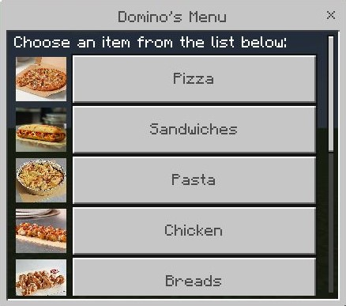
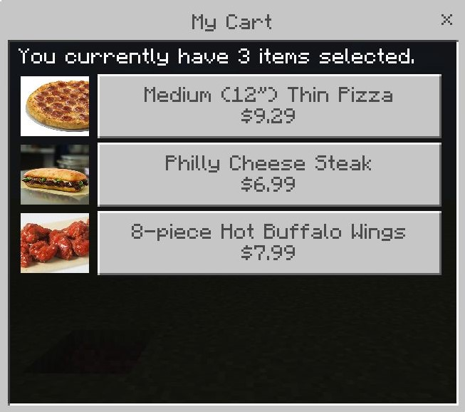
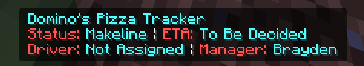

# pizzaplug
Have you ever been on your PocketMine-MP (4.0.0+) server, and thought:
> It'd be real nice if I could have order Domino's pizza through MCPE!

Well, today's your lucky day. pizzaplug is about to change the way you
sweat on twelve year olds for the better.

pizzaplug is a plugin for PocketMine which allows you to order Domino's
pizza without ever having to leave your game.

It uses the Domino's public API to send out an order to your address.

Run /pizza, enter your delivery information, select your local Domino's,
and choose what you'd like to eat from the interactable forms menus!

When you've selected everything you want, click on the "View Cart"
button to review your order before you send it in.

When you're satisfied with your selection, click the "Submit Order" button
at the bottom of the "View Cart" form. Once you click it, an order will be
sent to Domino's.

Don't worry - no payment information is taken. Instead, the payment method
is forced as cash, so you can rest assured knowing that your pizza is secure
pizza.

After Domino's processes your order, you'll see a message like this in chat:
> Your order was completed! A tracking indicator will be shown on top of your hotbar in a few seconds.

> The total was $11.36, make sure you have the cash ready before the driver arrives.

While you read that message, the plugin was busy communicating with the Domino's
Tracker. Yeah, that's right. It has tracking too!

After a few seconds of loading, you'll see a tracking indicator on top of your
hotbar. It'll show you everything you need to know - the ETA, order status, and the
driver and manager from the store.

This tracking indicator will automatically close after the order ends, such as the order
being delivered or the order being cancelled. (say you spam your local Domino's
with orders to debug your implementation of their API, sorry Brayden)

# todo
- [X] Local store searching
- [X] Menu requesting
- [X] Item selection
- [X] Ordering
- [X] Live tracking
- [ ] General code cleanup
- [ ] Full support for building your own pizzas